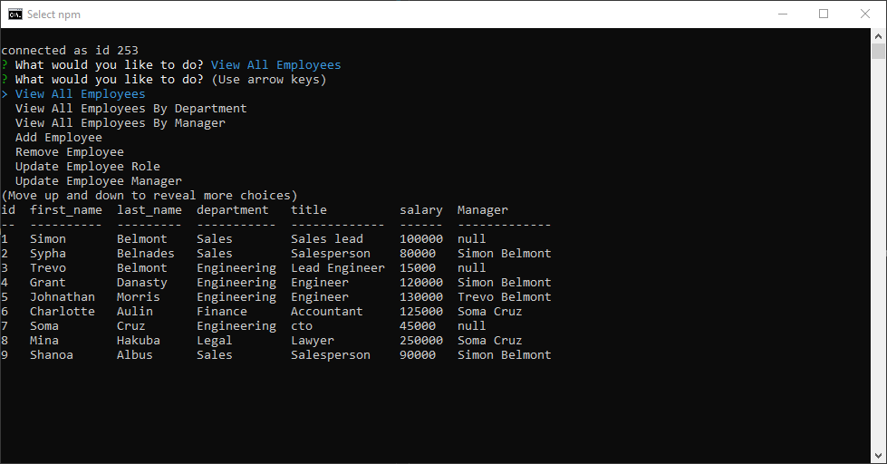

# employee_database

## Descriptions 
A command-line Content Management System, using node, inquirer, and MySQL. This application allows users to view and manage a company’s employee information.

## Table of contents
- [Functions](#functions)
  
- [Installation](#installation)
  
- [Links](#links) 

- [Screenshots](#Screenshots) 

- [License](#license) 

- [Questions](#questions) 

## Functions
- View all employees, view employee by department, view employee by manager.
- view department list, and view roles list
- Add and delete employees, roles, and departments.
- Update employee role and manager.
- View total budget of a department. 

## Installation

Clone github repo.

Run` npm install`,

then `npm start`

## Links

[Employee tracker demo ](https://drive.google.com/file/d/1KadfRdl_TFHA-HUBknXENMHjFBkJZNhl/view)

[Employee tracker github repo](https://github.com/realzzkevin/employee_database)

## Screenshots

## License

This project is licensed under the [mit](./LICENSE) license

## Questions
If you have any questions about the repo, Contact me at [realzzkevin@gmail.com](realzzkevin@gmail.com). You can find more of my works at [realzzkevin](https://github.com/realzzkevin)